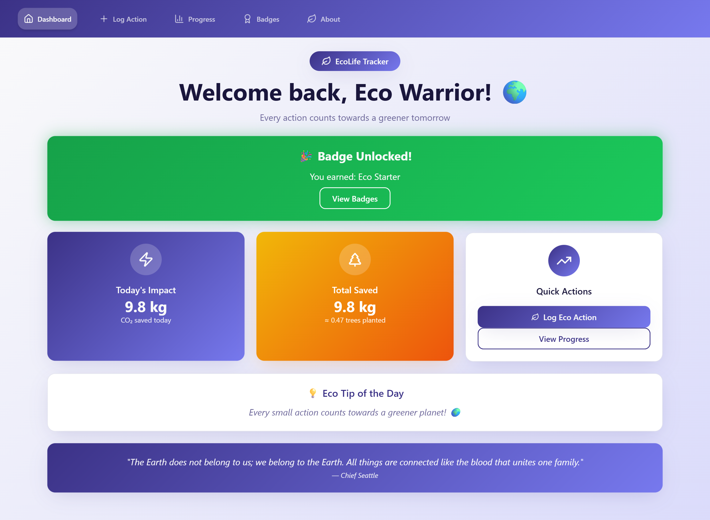

# 🌍 EcoLife Tracker


A modern, responsive Progressive Web App (PWA) for tracking eco-friendly actions and monitoring environmental impact. Built with React 18, TypeScript, and Tailwind CSS.

👉 **Live Demo**: [https://swayamdev.github.io/ecolife-tracker/](https://swayamdev.github.io/ecolife-tracker/)

---

## ✨ Features

- 📊 **Dashboard**: Overview of today's impact, total CO₂ saved, and quick actions
- 📝 **Log Actions**: Record eco-friendly activities (cycling, reusable bags, energy savings, etc.)
- 📈 **Progress Tracking**: Visualize environmental impact with interactive charts
- 🏆 **Achievement Badges**: Unlock rewards as you reach sustainability milestones
- 🌱 **About Section**: Learn about the mission and environmental facts
- 📱 **PWA Support**: Installable app with offline functionality
- ♿ **Accessibility**: WCAG AA compliant with full keyboard navigation
- 🎨 **Responsive Design**: Optimized for mobile, tablet, and desktop

---

## 📸 Preview



---

## 🚀 Getting Started

### Prerequisites

- Node.js 18+ or Bun
- npm, yarn, or bun package manager

### 1. Clone the repository

```bash
git clone https://github.com/swayamDev/ecolife-tracker.git
cd ecolife-tracker
```

### 2. Install dependencies

```bash
npm install
# or
bun install
```

### 3. Run the development server

```bash
npm run dev
# or
bun run dev
```

### 4. Build for production

```bash
npm run build
# or
bun run build

# Preview production build locally
npm run preview
# or
bun run preview
```

---

## 🛠️ Tech Stack

- **Framework**: [React 18](https://reactjs.org/)
- **Build Tool**: [Vite](https://vitejs.dev/)
- **Language**: [TypeScript](https://www.typescriptlang.org/)
- **Styling**: [Tailwind CSS](https://tailwindcss.com/)
- **UI Components**: [Shadcn UI](https://ui.shadcn.com/) + [Radix UI](https://www.radix-ui.com/)
- **Routing**: [React Router](https://reactrouter.com/)
- **Charts**: [Recharts](https://recharts.org/)
- **Icons**: [Lucide React](https://lucide.dev/)
- **Forms**: [React Hook Form](https://react-hook-form.com/) + [Zod](https://zod.dev/)
- **State Management**: [TanStack Query](https://tanstack.com/query)

---

## 🤝 Contributing

Feel free to fork and contribute to improve this tool!

```bash
git checkout -b feature/your-feature
git commit -m "Add your changes"
git push origin feature/your-feature
```

---

## 📄 License

This project is licensed under the [MIT License](LICENSE)

**URL**: https://swayamdev.github.io/ecolife-tracker/
